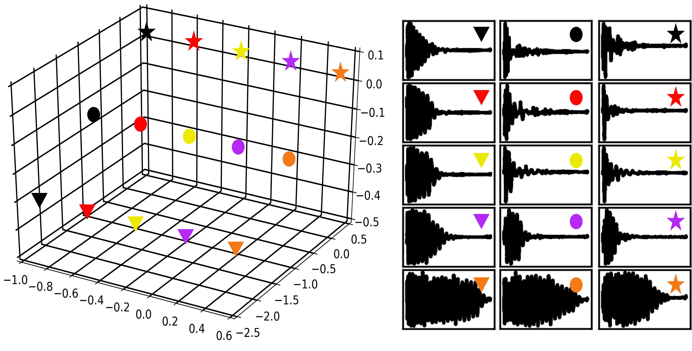

Overview of proposed system for drum synthesis: Generator (left) is trained 
to generate audio given a latent vector *z* and conditioning variable *y*. Discriminator (right) is trained to minimise
the Wasserstein distance between the generated distribution and the observed distribution. 

<h3>Audio Examples</h3>

Results accompanying the paper "Adversarial Synthesis of Drum sounds" for the International Conference on Digital Audio Effects 2020

# 

#### Training Data
A random selection of 30 examples from the dataset used in training

<figure>
    <figcaption>Kick drums</figcaption>
    <audio controls
		src="./dafx20_audio/real/realkicks.wav">
	</audio>
</figure>

<figure>
    <figcaption>Snare drums</figcaption>
    <audio controls
		src="./dafx20_audio/real/realsnares.wav">
	</audio>
</figure>

<figure>
    <figcaption>Cymbals</figcaption>
    <audio controls
		src="./dafx20_audio/real/realcymbals.wav">
	</audio>
</figure>

#### Generations
A random selection of 30 examples from the generated data.

<figure>
    <figcaption>Kick drums</figcaption>
    <audio controls
		src="./dafx20_audio/gen/genkicks.wav">
	</audio>
</figure>

<figure>
    <figcaption>Snare drums</figcaption>
    <audio controls
		src="./dafx20_audio/gen/gensnares.wav">
	</audio>
</figure>

<figure>
    <figcaption>Cymbals</figcaption>
    <audio controls
		src="./dafx20_audio/gen/gencymbals.wav">
	</audio>
</figure>

#### Usage demonstration

Example usage within loop-based electronic music compositions. 
The percussive elements of the following tracks were created using a selection
of samples from the generated data. A light amount of post-processing (equalisation and volume envelope shaping)
was applied to mix the sounds.

<figure>
    <figcaption>Track 1: Hip hop demo</figcaption>
    <audio controls
		src="./dafx20_audio/track_demos/hiphopdemo.wav">
	</audio>
</figure>

<figure>
    <figcaption>Track 2: Drum and bass demo</figcaption>
    <audio controls
		src="./dafx20_audio/track_demos/drumandbassdemo.wav">
	</audio>
</figure>

#### Interpolation demonstration

A demonstration showing how sounds can be fine-tuned by interpolating different latent dimensions.
For the following experiments, the GAN was trained with a latent space dimensionality of size 3.

###### Linear interpolation

<figure>
    <figcaption>Interpolating the first dimension of the latent space, 
    whilst keeping the second and third dimensions fixed </figcaption>
    <audio controls
		src="./DAFx19_audio/adt-dt/redrummings/moving_1D.wav">
	</audio>
</figure>

<figure>
    <figcaption>Interpolating the second dimension of the latent space, 
    whilst keeping the first and third dimensions fixed </figcaption>
    <audio controls
		src="./DAFx19_audio/adt-dt/redrummings/moving_2D.wav">
	</audio>
</figure>

<figure>
    <figcaption>Interpolating the third dimension of the latent space, 
    whilst keeping the first and second dimensions fixed </figcaption>
    <audio controls
		src="./DAFx19_audio/adt-dt/redrummings/moving_3D.wav">
	</audio>
</figure>

<figure>
    <figcaption>Interpolating the second and third dimensions of the latent space, 
    whilst keeping the first dimension fixed </figcaption>
    <audio controls
		src="./DAFx19_audio/adt-dt/redrummings/fixed_1D.wav">
	</audio>
</figure>

<figure>
    <figcaption>Interpolating the first and third dimensions of the latent space, 
    whilst keeping the second dimension fixed </figcaption>
    <audio controls
		src="./DAFx19_audio/adt-dt/redrummings/fixed_2D.wav">
	</audio>
</figure>

<figure>
    <figcaption>Interpolating the first and second dimensions of the latent space, 
    whilst keeping the third dimension fixed </figcaption>
    <audio controls
		src="./DAFx19_audio/adt-dt/redrummings/fixed_3D.wav">
	</audio>
</figure>

###### Spherical interpolation

<figure>
    <figcaption>Interpolating the first dimension of the latent space, 
    whilst keeping the second and third dimensions fixed </figcaption>
    <audio controls
		src="./DAFx19_audio/adt-dt/redrummings/moving_1D.wav">
	</audio>
</figure>

<figure>
    <figcaption>Interpolating the second dimension of the latent space, 
    whilst keeping the first and third dimensions fixed </figcaption>
    <audio controls
		src="./DAFx19_audio/adt-dt/redrummings/moving_2D.wav">
	</audio>
</figure>

<figure>
    <figcaption>Interpolating the third dimension of the latent space, 
    whilst keeping the first and second dimensions fixed </figcaption>
    <audio controls
		src="./DAFx19_audio/adt-dt/redrummings/moving_3D.wav">
	</audio>
</figure>

<figure>
    <figcaption>Interpolating the second and third dimensions of the latent space, 
    whilst keeping the first dimension fixed </figcaption>
    <audio controls
		src="./DAFx19_audio/adt-dt/redrummings/fixed_1D.wav">
	</audio>
</figure>

<figure>
    <figcaption>Interpolating the first and third dimensions of the latent space, 
    whilst keeping the second dimension fixed </figcaption>
    <audio controls
		src="./DAFx19_audio/adt-dt/redrummings/fixed_2D.wav">
	</audio>
</figure>

<figure>
    <figcaption>Interpolating the first and second dimensions of the latent space, 
    whilst keeping the third dimension fixed </figcaption>
    <audio controls
		src="./DAFx19_audio/adt-dt/redrummings/fixed_3D.wav">
	</audio>
</figure>

# 

 

Examples generations