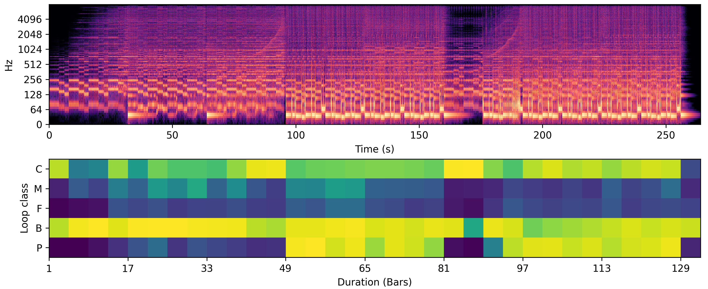

<!--- Drysdale, J. and Ramires, A. and Fonseca, E. and Font, F. and Serra, X. and J. Hockman. 2021. Adversarial synthesis of drum sounds. In Proceedings of the 22nd International Society for Music Information Retrieval, Online. -->

<!---####Improved Automatic Instrumentation Role Classification and Structural Analysis for Electronic Music Production -->
<!---
<h3>Improved Automatic Instrumentation Role Classification and Structural Analysis for Electronic Music Production</h3>
-->

<!---[[pdf](https://dafx2020.mdw.ac.at/proceedings/papers/DAFx2020_paper_45.pdf),
[presentation](https://dafx2020.mdw.ac.at/proceedings/presentations/paper_45.mp4)]-->

Modern loop-based electronic music (EM) is created through the activation of short audio recordings of instruments designed for seamless repetition—or loops.
In this work, we aim to label loops into key structural groups such as bass, percussion or melodies by the role they occupy in a piece of music. For this, we use a task called automatic instrumentation role classification (AIRC).

These labels assist EM producers in organizing and identifying compatible loops within large unstructured audio databases. While annotating the audio files by hand is hard work, automatic classification allows for fast and scalable generation of these labels.

In this work, we experimented with several deep-learning architectures and proposed a data augmentation method which allowed us to reach a high-accuracy classification.

Besides the obvious task of classifying instrumentation roles in large collections of loops, we evaluated how our model could be used for identifying the structure of electronic music compositions
(⚠SPOILER ALERT⚠ You’ll want it on your favourite DJ Software!).

###Methodology
 
We aim to classify the instrumentation roles of audio loops automatically. Instead of trying to find relevant characteristics of each class for this classification, we chose to approach the problem from a data-driven methodology, where deep-learning models can learn these relevant characteristics from the data itself.

The first step to solve this problem is therefore to find good quality data (similar to the data we want to classify). The [Freesound Loop Dataset (FSLD)](https://zenodo.org/record/3967852) comprises thousands of loops from [freesound.org](https://freesound.org/) with annotations such as their tempo, key, genre and instrumentation roles. It arises as the ideal dataset to use for this task, due to its high-quality professional data, the exact instrumentation role labels we are looking for and the Creative Commons licenses which are ideal for research.

One disadvantage of this dataset is the lack of sufficient data with more than one instrumentation role, as half the loops only have one component. To tackle this, we turned on our music maker parts of the brain and decided on an approach: merging single component loops together by matching their tempo and key to create new examples. This enabled us to create a balanced dataset with 25000 loops, where each class is equally represented.

The next step is selecting the appropriate deep-learning model for this task. A variety of architectures have been proposed for music classification tasks. We shortlisted the ones that, according to our intuition, would work best for the task, evaluated them and selected the best performing ones. After this, we experimented with slight modifications to the architectures, such as the use of different loss functions and pooling functions and chose the best performing model.

###Analysing the Structure of Loop-based Electronic Music
 

<!---  -->

The model we developed to classify the instrumentation roles of loops can easily be adapted to classify the loops of an EM composition. Knowing the tempo of a track, we chop it up into 4-bar consecutive segments which are fed to our model. The output is an *instrumentation role activation map* (IRAM), which exhibits how likely an instrumentation role is present in each 4 bars of a music piece. Figure 2 presents an IRAM of the EM composition
<a href="https://omunit.bandcamp.com/track/joyspark-bandcamp-exclusive">Joyspark</a> (2020) by Om Unit using our proposed method for loop-based EM structure analysis.
For visualisation and comparison, we show a log-scaled STFT power spectrum of the EM composition above the IRAM.

<!---

    
    <audio
            controls
            src="./Eastern-Kingbird.wav">
    </audio>

 -->

The IRAM allows us to visualise activations for each role over the duration of the EM composition, where each square is a measurement of four bars.
Furthermore, we can see how each role develops throughout the EM composition.
For example, the melody role activations progressively increase between bars 1--41, which corresponds with a synthesizer arpeggio that is gradually introduced by automating the cut-off frequency of a low-pass filter.
Additionally, the chord role activations increase between bars 1--49 in correlation with the chords in this section that gradually increase in volume.
Activations for the percussion role also correlate well with the composition as can be seen between bars 49--81 and 97--129---the only sections that contain percussion.
Finally, the key structural sections of the composition are easily identifiable.
For example, the introduction to the composition (bars 1--49) begins relatively sparse in the composition and IRAM; whereas, bars 49--81 and 97--129 are quite clearly the *core* of the piece---that is, the most energetic sections of the composition typically established by the *drop*.

 

###Dataset
In order to evaluate how well our system can analyze the structure of professionally produced EM, we compiled a dataset of 10 compositions. The dataset covers several popular EM genres such as hip-hop, drum and bass, techno, house and garage (with a tempo range of 120-175 BPM). The tracks were collected from Soundcloud and Bandcamp and are available under a Creative Commons license. Ground truth annotations were obtained by listening through each composition and labelling the active instrumentation roles at 4-bar intervals. The activations for each track can be downloaded via the corresponsing link and the roles are order as follows: Bass (0), Drums (1), FX (2), Melody (3). 

| Title                               | Artist         | Genre       | BPM | Source                                                                                            | Duration | Annotations |
| ----------------------------------- | -------------- | ----------- | --- | ------------------------------------------------------------------------------------------------- | -------- | ----------- |
| Come On Let’s Go                    | Le Gang        | Hip Hop     | 154 | [Soundcloud](https://soundcloud.com/thisislegang/come-on-lets-go)                                 | 02:26    | [Download](./annotations/0_role_activations.npy)    |
| Rap Instrumental (Eminem Type Beat) | Rick Da Sauce  | Hip Hop     | 172 | [Soundcloud](https://soundcloud.com/rickdasauce/rap-instrumental-eminem-type)                     | 03:10    | [Download](./annotations/1_role_activations.npy)    |
| Fear Bomb                           | Skorpion       | DnB         | 170 | [Soundcloud](https://soundcloud.com/n-e-u-r-o-d-n-b/skorpion-fear-bomb-neurodnb)                  | 03:51    | [Download](./annotations/2_role_activations.npy)    |
| The Way It Is                       | Sonido Berzerk | Garage      | 140 | [Bandcamp](https://sonidoberzerk1.bandcamp.com/track/the-way-it-is)                               | 04:13    | [Download](./annotations/3_role_activations.npy)    |
| I Don’t Need U 2 Say Anything       | Le Gang        | Hip Hop     | 136 | [Soundcloud](https://soundcloud.com/thisislegang/i-dont-need-u-2-say-anything)                    | 02:23    | [Download](./annotations/4_role_activations.npy)    |
| Robinson Jr.                        | Stoertebeker   | House       | 126 | [Bandcamp](https://digitaldiamonds.bandcamp.com/track/robinson-jr)                                | 06:13    | [Download](./annotations/5_role_activations.npy)    |
| Neuroluminescence                   | Medular        | Psytrance   | 128 | [Bandcamp](https://digitaldiamonds.bandcamp.com/track/neuroluminescence)                          | 09:25    | [Download](./annotations/6_role_activations.npy)    |
| Slow It Down                        | Aztek, Prinsh  | House (EDM) | 124 | [Soundcloud](https://soundcloud.com/djprinsh/aztek-prinsh-slow-it-down-original-mix-so-track-boa) | 05:48    | [Download](./annotations/7_role_activations.npy)    |
| East                                | Chump Change   | Jungle      | 160 | [Bandcamp](https://yarnaudio.bandcamp.com/track/east-feat-deserved)                               | 04:04    | [Download](./annotations/8_role_activations.npy)    |
| Minotauro                           | Langax         | Acid        | 119 | [Bandcamp](https://soisloscerdos.bandcamp.com/track/minotauro)                                    | 04:42    | [Download](./annotations/9_role_activations.npy)    |

