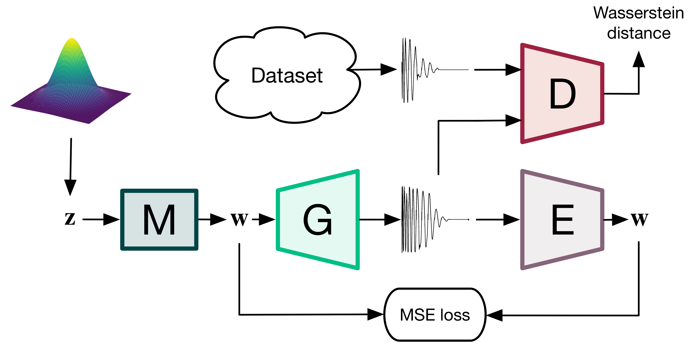
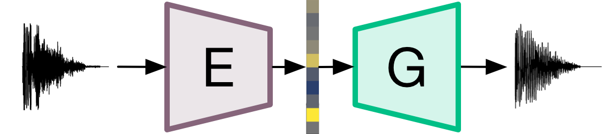
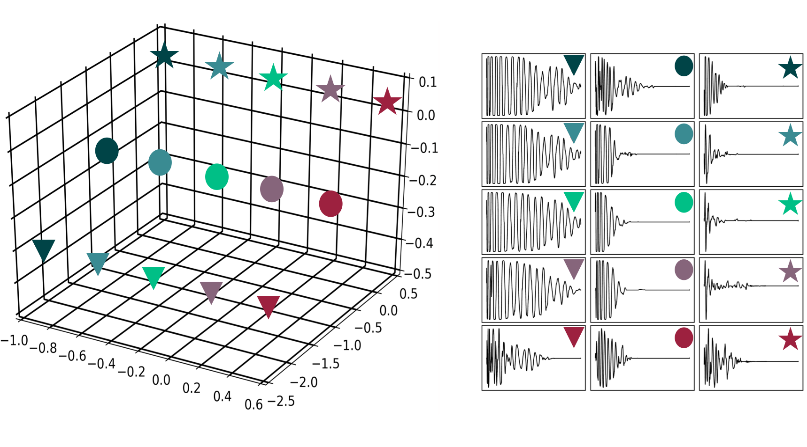

Drysdale, J. and Tomczak, M. and J. Hockman. 2021. Style-based Drum Synthesis with GAN Inversion. In *Extended Abstracts for the Late-Breaking Demo Sessions of the 22nd International Society for Music Information Retrieval Conference, Online*.

[[paper](https://archives.ismir.net/ismir2021/latebreaking/000041.pdf), 
[poster](./lbd_posterv2.pdf)]

This blog post contains the supplementary material accompanying the late-breaking demo:  "Style-based Drum Synthesis with GAN Inversion" for the International Society for Music Information Retrieval (ISMIR).

<h3>Abstract</h3>

Neural audio synthesizers exploit deep learning as an alternative to traditional synthesizers that generate audio from hand-designed components such as oscillators and wavetables. For a neural audio synthesizer to be applicable to music creation, meaningful control over the output is essential. This paper provides an overview of an unsupervised approach to deriving useful feature controls learned by a generative model. A system for generation and transformation of drum samples using a style-based generative adversarial network (GAN) is proposed. The system provides functional control of style features of drum sounds based on principal component analysis (PCA) applied to the latent space. Additionally, we propose the use of an encoder trained to invert input drum sounds back to the latent space of the pre-trained GAN. We experiment with three modes of control and provide audio results on a supporting website. 

<h3>Code</h3>

The GitHub repository for this project is available **[here](https://github.com/SoMA-group/stylegan-drumsynth)**. The repo contains instructions for installation and usage for a TensorFlow implementation of the style-based drum synthesiser and audio inversion network. 

<h3>Audio Examples</h3>

# 

#### Training Data Vs Generations
An comparison between: (left) a random selection of some examples from the dataset used in training and, (right) a random selection of drum sound generations.

<figure>
    <figcaption>Kick drums</figcaption>
    <audio controls
		src="./LBD_audio/kicks_real.wav">
	</audio>
    <audio controls
		src="./LBD_audio/kick_generations_demo.wav">
	</audio>
</figure>

<figure>
    <figcaption>Snare drums</figcaption>
    <audio controls
		src="./LBD_audio/snares_real.wav">
	</audio>
    <audio controls
		src="./LBD_audio/snare_generations_demo.wav">
	</audio>
</figure>

<figure>
    <figcaption>Cymbals</figcaption>
    <audio controls
		src="./LBD_audio/hats_real.wav">
	</audio>
    <audio controls
		src="./LBD_audio/hat_generations_demo.wav">
	</audio>
</figure>

#### Audio Inversion Network

An A-B comparsion of encoding audio input (A) with the audio inversion network and drum sound generations (B) with the inverted latent code. (Left) the audio input and, (right) the corresponding generation.

<figure>
    <figcaption>Kick drums</figcaption>
    <audio controls
		src="./LBD_audio/kick_encoder_A.wav">
	</audio>
    <audio controls
		src="./LBD_audio/kick_encoder_B.wav">
	</audio>
</figure>

<figure>
    <figcaption>Snare drums</figcaption>
    <audio controls
		src="./LBD_audio/snare_encoder_A.wav">
	</audio>
    <audio controls
		src="./LBD_audio/snare_encoder_B.wav">
	</audio>
</figure>

<figure>
    <figcaption>Cymbals</figcaption>
    <audio controls
		src="./LBD_audio/hat_encoder_A.wav">
	</audio>
    <audio controls
		src="./LBD_audio/hat_encoder_B.wav">
	</audio>
</figure>

Additionally, the examples below demonstrate the systems capacity to generate drum sounds from alternative audio inputs such as beatboxing and sliced breakbeats. 

<figure>
    <figcaption>Beatbox to drum sound</figcaption>
    <audio controls
		src="./LBD_audio/beatbox_to_gan.wav">
	</audio>
</figure>

<figure>
    <figcaption>Hip-hop breakbeat to drum sound</figcaption>
    <audio controls
		src="./LBD_audio/hiphop_to_gan.wav">
	</audio>
</figure>

<figure>
    <figcaption>Amen break to drum sound</figcaption>
    <audio controls
		src="./LBD_audio/amen_to_gan.wav">
	</audio>
</figure>

#### Usage demonstration

Example usage within loop-based electronic music compositions. 
The percussive elements of the following tracks were created using a selection
of samples from the generated data. A light amount of post-processing (equalisation and volume envelope shaping)
was applied to mix the sounds.

<figure>
    <figcaption>Track 1: Hip hop demo</figcaption>
    <audio controls
		src="./dafx20_audio/track_demos/hiphopdemo.wav">
	</audio>
</figure>

<figure>
    <figcaption>Track 2: Drum and bass demo</figcaption>
    <audio controls
		src="./dafx20_audio/track_demos/drumandbassdemo.wav">
	</audio>
</figure>

<figure>
    <figcaption>Track 3: Breakbeat interpolation demo</figcaption>
    <audio controls
		src="./LBD_audio/break-morphing.wav">
	</audio>
</figure>

##### Interpolating between two arbitrary drum sounds

Below are some examples of the systems capacity reconstruct two arbitrary and performing interpolation between them. (Left) source A, (right) source 2, and (below) interpolation between A and B. (under construction)

<figure>
    <figcaption>Kick-to-kick interpolation</figcaption>
    <audio controls
		src="">
	</audio>
    <audio controls
		src="">
	</audio>
    <audio controls
		src="">
	</audio>
</figure>

<figure>
    <figcaption>Snare-to-snare interpolation</figcaption>
    <audio controls
		src="">
	</audio>
    <audio controls
		src="">
	</audio>
    <audio controls
		src="">
	</audio>
</figure>

<figure>
    <figcaption>hat-to-hat interpolation</figcaption>
    <audio controls
		src="">
	</audio>
    <audio controls
		src="">
	</audio>
    <audio controls
		src="">
	</audio>
</figure>

Some more examples can be found here: https://soundcloud.com/beatsbygan

#### Interpolation demonstration

The proposed system learns to map points in the latent space to the generated waveforms. The structure of the latent space can be explored by interpolating between points in the space. For the following experiments, the GAN was trained with a latent space dimensionality of size 3.

Figure 2: Interpolation in the latent space for kick drum generation. Kick drums are generated for each point along linear 
pathsthrough the latent space (left). Paths are colour coded and subsequent generated audio appears across rows (right).

##### A to B interpolation

In the following examples, two generated drum samples are selected and their latent vectors are noted. A linear path of 30 steps between each latent vector is created and a waveform is generated for each of those 30 steps.

Interpolating between Snare A and Snare B.

<figure>
    <figcaption>Snare A</figcaption>
    <audio controls
		src="./dafx20_audio/interpolation_demos/a_b_demos/snare_a.wav">
	</audio>
</figure>
<figure>
    <figcaption>Snare B</figcaption>
    <audio controls
		src="./dafx20_audio/interpolation_demos/a_b_demos/snare_b.wav">
	</audio>
</figure>
<figure>
    <figcaption>Linear interpolation</figcaption>
    <audio controls
		src="./dafx20_audio/interpolation_demos/a_b_demos/demo1_interpolate.wav">
	</audio>
</figure>

Interpolating between Kick A and Kick B.

<figure>
    <figcaption>Kick A</figcaption>
    <audio controls
		src="./dafx20_audio/interpolation_demos/a_b_demos/kick_a.wav">
	</audio>
</figure>
<figure>
    <figcaption>Kick B</figcaption>
    <audio controls
		src="./dafx20_audio/interpolation_demos/a_b_demos/kick_b.wav">
	</audio>
</figure>
<figure>
    <figcaption>Linear interpolation</figcaption>
    <audio controls
		src="./dafx20_audio/interpolation_demos/a_b_demos/demo2_interpolate.wav">
	</audio>
</figure>

Interpolating between Cymbal A and Cymbal B.

<figure>
    <figcaption>Cymbal A</figcaption>
    <audio controls
		src="./dafx20_audio/interpolation_demos/a_b_demos/cymbal_a.wav">
	</audio>
</figure>
<figure>
    <figcaption>Cymbal B</figcaption>
    <audio controls
		src="./dafx20_audio/interpolation_demos/a_b_demos/cymbal_b.wav">
	</audio>
</figure>
<figure>
    <figcaption>Linear interpolation</figcaption>
    <audio controls
		src="./dafx20_audio/interpolation_demos/a_b_demos/demo3_interpolate.wav">
	</audio>
</figure>

 

